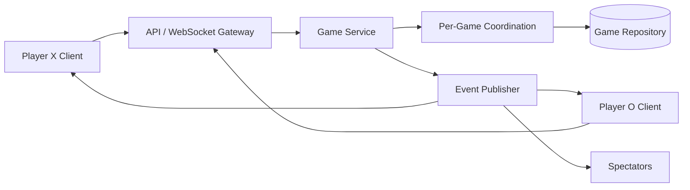

# Advanced Tic Tac Toe — Phase 2 and Phase 3

This document intentionally begins after the final Phase 1 design in `TicTacToe.java` and `INTERVIEW_TIC_TAC_TOE_REVISIONS.md`.

Phase 1 should remain small. The features below are extensions to discuss only after the interviewer is satisfied with the core game.

---

## 1. Phase progression

```text
Phase 1: Correct local game
    |
    v
Phase 2: Extensible game features
    |
    v
Phase 3: Online multiplayer and scale
```

### Phase 1 — completed

- configurable `N x N` board;
- two local players;
- automatic turns;
- move validation;
- row, column, and diagonal wins;
- draw detection;
- clear separation between `Board`, `Player`, and `Game`.

### Phase 2 — product features

- AI opponent;
- configurable winning length;
- move history;
- undo and redo;
- game replay;
- observers for UI or analytics;
- configurable starting-player policy.

### Phase 3 — distributed multiplayer

- remote players;
- multiple simultaneous game sessions;
- authentication and authorization;
- persistent game state;
- concurrent move protection;
- reconnect and timeout handling;
- real-time event delivery;
- horizontal scaling.

---

# 2. Phase 2 — AI opponent

## Requirement

Allow a human to play against the computer with different difficulty levels.

The AI decision changes, but the core game rules do not. This is a genuine use case for the **Strategy Pattern**.

```java
interface MoveStrategy {
    Position chooseMove(BoardView board, Symbol symbol);
}
```

Possible implementations:

```java
final class RandomMoveStrategy implements MoveStrategy {
    // Choose any legal position.
}

final class WinningMoveStrategy implements MoveStrategy {
    // Win immediately, block opponent, otherwise choose a legal position.
}

final class MinimaxStrategy implements MoveStrategy {
    // Explore the game tree to choose the best move.
}
```

## Why Strategy fits

- algorithms vary independently;
- difficulty can change at runtime;
- `Game` should not contain `if (difficulty == ...)` branches;
- adding another AI does not modify existing algorithms.

## Important design improvement

Do not give an AI strategy a mutable `Board`. Give it a read-only view or defensive copy:

```java
interface BoardView {
    int getSize();
    Symbol getSymbolAt(int row, int column);
    boolean isCellEmpty(int row, int column);
}
```

This prevents an AI from bypassing `Game.playMove` and mutating game state directly.

---

# 3. Phase 2 — configurable winning length

A larger board may use a winning length smaller than its size.

Examples:

- 3×3 board, 3 required;
- 5×5 board, 4 required;
- 10×10 board, 5 required.

Introduce immutable rules:

```java
final class GameRules {
    private final int boardSize;
    private final int winningLength;

    public GameRules(int boardSize, int winningLength) {
        if (boardSize < 3) {
            throw new IllegalArgumentException("Board size must be at least 3");
        }
        if (winningLength < 3 || winningLength > boardSize) {
            throw new IllegalArgumentException("Invalid winning length");
        }
        this.boardSize = boardSize;
        this.winningLength = winningLength;
    }
}
```

## Design consequence

The Phase 1 win check examines an entire row, column, or diagonal. With a smaller winning length, the board must search for consecutive symbols around the last move.

A `WinningRule` abstraction may now be justified:

```java
interface WinningRule {
    boolean hasWon(BoardView board, Position lastMove, Symbol symbol);
}
```

This is another Strategy Pattern use case because winning behavior now genuinely varies.

---

# 4. Phase 2 — move history

Represent a successful move explicitly:

```java
record Position(int row, int column) {}

record Move(
        int moveNumber,
        String playerName,
        Symbol symbol,
        Position position,
        long playedAt
) {}
```

`Game` stores successful moves in order:

```java
private final List<Move> history = new ArrayList<>();
```

Benefits:

- auditability;
- move display;
- replay;
- debugging;
- foundation for undo/redo.

Invalid move attempts should not enter the successful move history. If auditing rejected actions is required, store them separately as events.

---

# 5. Phase 2 — undo and redo

Undo and redo make the **Command Pattern** useful.

```java
interface Command {
    void execute();
    void undo();
}
```

A move command contains enough information to apply and reverse one move:

```java
final class MoveCommand implements Command {
    private final Board board;
    private final Position position;
    private final Symbol symbol;

    @Override
    public void execute() {
        board.placeSymbol(position.row(), position.column(), symbol);
    }

    @Override
    public void undo() {
        board.removeSymbol(position.row(), position.column());
    }
}
```

Two stacks can support undo and redo:

```text
execute command -> push onto undo stack -> clear redo stack
undo            -> pop undo -> reverse -> push redo
redo            -> pop redo -> execute -> push undo
```

## Additional state to restore

Undoing a move affects more than the cell:

- current player;
- game status;
- winner;
- occupied-cell count;
- move history.

Therefore, the command must restore the complete affected game state, or the game must recompute derived state after undo.

This is why undo belongs in Phase 2 rather than Phase 1.

---

# 6. Phase 2 — event notifications

A UI, logger, analytics system, or spectator view may need updates when something happens.

Possible events:

- move accepted;
- move rejected;
- player changed;
- player won;
- game drawn.

This can justify the **Observer Pattern**:

```java
interface GameObserver {
    void onGameEvent(GameEvent event);
}
```

`Game` publishes domain events without depending on a console or graphical UI.

Benefits:

- game logic remains independent of presentation;
- multiple listeners can react;
- easier testing;
- useful bridge toward remote multiplayer.

Avoid introducing Observer if the only requirement is printing to the console.

---

# 7. Phase 3 — online multiplayer architecture

A production system must manage many games and remote clients.



## Main components

### `GameSession`

Represents one online match:

- session ID;
- two player IDs;
- game state;
- connection state;
- version number;
- last activity time.

### `GameService`

Application-level use cases:

- create game;
- join game;
- submit move;
- obtain current state;
- reconnect;
- resign.

### `GameRepository`

Persists sessions behind an interface:

```java
interface GameRepository {
    GameSession findById(String gameId);
    void save(GameSession session);
}
```

This demonstrates **Dependency Inversion**: game services depend on a repository abstraction rather than a particular database.

### Real-time gateway

WebSocket or Server-Sent Events can push accepted moves and state changes to connected clients.

---

# 8. Phase 3 — race condition

Suppose both remote clients send a move almost simultaneously:

```text
Request A reads version 7
Request B reads version 7
Request A places X and saves version 8
Request B places O and also saves based on version 7
```

Without coordination, a move can be lost or applied out of turn.

## Option A: Per-game in-memory lock

Suitable when one server owns a game:

```java
ConcurrentHashMap<String, ReentrantLock> locks;
```

This does not coordinate multiple server instances.

## Option B: Optimistic locking

Persist a version with each game:

```text
UPDATE games
SET state = ?, version = 8
WHERE game_id = ? AND version = 7
```

If zero rows are updated, another request changed the game first. Reload and reject or retry.

This is often a good fit because conflicts are uncommon and transactions remain short.

## Option C: Distributed lock

Acquire a lock using Redis or another coordinator before applying a move.

This can work, but introduces:

- lock expiry;
- owner tokens;
- safe release;
- network partitions;
- stale lock handling.

Do not claim that a Java `synchronized` block protects the same game across multiple machines. It protects only one JVM.

---

# 9. Phase 3 — idempotency

A client may retry a move because it did not receive a response. The server may already have applied the original request.

Each move request should carry an idempotency key or client move ID:

```text
POST /games/{gameId}/moves
{
  "moveId": "client-generated-uuid",
  "expectedVersion": 7,
  "row": 1,
  "column": 2
}
```

If the same `moveId` arrives again, return the original result instead of applying the move twice.

This protects against duplicate network delivery, which is different from turn validation.

---

# 10. Phase 3 — reconnection and timeout

A disconnected player should be able to recover the authoritative state.

On reconnection:

1. authenticate the player;
2. verify membership in the game;
3. load the latest persisted state;
4. send current board, current player, status, and version;
5. resume event delivery.

Timeout policy must be clarified:

- no timeout;
- fixed turn timeout;
- disconnect grace period;
- forfeit after expiry;
- abandon the match after both players disconnect.

This policy belongs in the game/session layer, not in `Board`.

---

# 11. Phase 3 — security and authorization

The server must not trust client-supplied game state.

Clients should send intent only:

```text
"I want to place my symbol at row 1, column 2."
```

The server verifies:

- authenticated player identity;
- player belongs to the game;
- it is that player's turn;
- expected game version matches;
- coordinates are valid;
- cell is empty;
- game is still active.

The server remains the authoritative source of truth.

---

# 12. Advanced complexity

## Phase 1

- Board initialization: `O(N^2)`
- Place symbol: `O(1)`
- Win detection after a move: `O(N)`
- Full-board detection with counter: `O(1)`
- Board storage: `O(N^2)`

## Configurable winning length

A carefully implemented directional search around the last move remains `O(N)` in the worst case.

## Minimax

For a standard 3×3 game, brute-force Minimax is practical because the search space is small. Conceptually, it is exponential in the number of empty cells.

For larger boards:

- alpha-beta pruning;
- depth limits;
- heuristic evaluation;
- Monte Carlo Tree Search

may be required.

## Distributed system

Lookup and move submission are typically `O(1)` application operations plus persistence and network latency. Correctness, consistency, and contention matter more than local algorithmic complexity.

---

# 13. Recommended interview progression

Do not begin with all advanced classes.

Use this sequence:

1. Clarify board size, players, symbols, and winning rule.
2. Present `Player`, `Board`, `Game`, and enums.
3. Explain the responsibility split.
4. Implement `playMove` and board win detection.
5. Discuss complexity and edge cases.
6. Only then respond to extensions:
   - AI -> Strategy;
   - undo/redo -> Command;
   - UI notifications -> Observer;
   - multiple creation modes -> Factory;
   - online games -> sessions, persistence, versioning, idempotency, coordination.

A strong answer grows with the requirements instead of presenting an over-engineered final architecture immediately.

---

# 14. Advanced interview summary

> Phase 1 is an in-memory domain model: Board owns board state and win analysis, while Game orchestrates players, turns, and lifecycle. Phase 2 introduces changing behavior such as AI and configurable rules using strategies, plus command-based history for undo and replay. Phase 3 introduces online sessions, persistence, authorization, real-time events, idempotent requests, and concurrency control through optimistic versioning or distributed coordination. Each abstraction is introduced only when its corresponding requirement appears.
